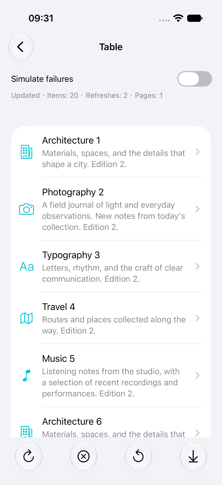
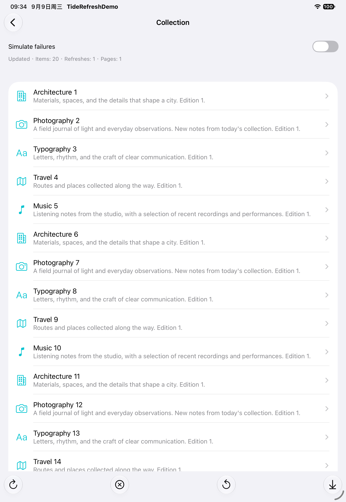

# TideRefresh

[简体中文](README.zh-Hans.md)

A Swift 6 UIKit refresh and pagination library for vertical `UIScrollView`,
`UITableView`, and `UICollectionView` on iOS/iPadOS 16+. The core is distributed
with Swift Package Manager and has **zero external dependencies**.

TideRefresh provides pull-to-refresh, pull/automatic/prefetch footers, bounded
short-content filling, cancellable async and callback operations, and replaceable
animators. It preserves the application's scroll delegate without swizzling.
The application continues to own its items and data source.

## Status and Installation

This is an **unreleased 0.1 candidate**. No version tag or release is available.
During review, add the documentation branch in Xcode's Add Package Dependencies,
or use this dependency in an iOS package:

```swift
dependencies: [
    .package(
        url: "https://github.com/KahnLi-lyc/TideRefresh.git",
        branch: "codex/p4-documentation"
    ),
]
```

Link `.product(name: "TideRefresh", package: "TideRefresh")` to your target.
The PRs are unmerged; `main` currently contains only the bootstrap. Use
`codex/p4-documentation` for the full candidate and switch to `main` only after
the dependent PRs have merged. Branch dependencies are
mutable; commit your application's resolved package versions for reproducibility.

Requirements: Swift 6.0-compatible language mode, UIKit, and iOS/iPadOS 16+.
Horizontal scrolling, inverted chat, nested-scroll arbitration, SwiftUI, macOS,
and Mac Catalyst are outside the supported scope.

## Async Refresh and Cursor Pagination

This complete controller fetches JSON shaped like
`{"items":[{"id":1,"title":"First"}],"nextCursor":"page-2"}`.
Pass your endpoint to `FeedViewController(endpoint:)`; the server should omit
`nextCursor` or return `null` on the final page.

```swift
import Foundation
import UIKit
import TideRefresh

struct FeedItem: Decodable, Sendable {
    let id: Int
    let title: String
}

private struct FeedResponse: Decodable, Sendable {
    let items: [FeedItem]
    let nextCursor: String?
}

@MainActor
final class FeedViewController: UITableViewController {
    private let endpoint: URL
    private var items: [FeedItem] = []
    private var refreshController: RefreshController?
    private var pagination: PaginationCoordinator<FeedItem, String>?

    init(endpoint: URL) {
        self.endpoint = endpoint
        super.init(style: .plain)
    }

    required init?(coder: NSCoder) { nil }

    override func viewDidLoad() {
        super.viewDidLoad()
        let endpoint = endpoint
        pagination = PaginationCoordinator(
            loader: { request in
                guard var components = URLComponents(url: endpoint, resolvingAgainstBaseURL: false) else {
                    throw URLError(.badURL)
                }
                if case let .nextPage(cursor) = request {
                    components.queryItems = (components.queryItems ?? []) + [
                        URLQueryItem(name: "cursor", value: cursor),
                    ]
                }
                guard let url = components.url else { throw URLError(.badURL) }
                let (data, response) = try await URLSession.shared.data(from: url)
                guard let response = response as? HTTPURLResponse,
                      (200..<300).contains(response.statusCode) else {
                    throw URLError(.badServerResponse)
                }
                let page = try JSONDecoder().decode(FeedResponse.self, from: data)
                return Page(items: page.items, nextCursor: page.nextCursor)
            },
            onUpdate: { [weak self] update in
                guard let self else { return }
                switch update {
                case let .replace(items): self.items = items
                case let .append(items): self.items.append(contentsOf: items)
                }
                self.tableView.reloadData()
            }
        )

        do {
            let controller = try RefreshController(scrollView: tableView)
            refreshController = controller
            controller.setAsyncHandlers(
                refresh: { [weak self] in
                    guard let pagination = self?.pagination else { return .cancelled }
                    let hasMore = try await pagination.refresh()
                    return .success(hasMoreData: hasMore)
                },
                loadMore: { [weak self] in
                    guard let pagination = self?.pagination else { return .cancelled }
                    let hasMore = try await pagination.loadMore()
                    return .success(hasMoreData: hasMore)
                }
            )
            controller.beginRefreshing()
        } catch {
            assertionFailure("Refresh attachment failed: \(error)")
        }
    }

    override func tableView(_ tableView: UITableView, numberOfRowsInSection section: Int) -> Int {
        items.count
    }

    override func tableView(
        _ tableView: UITableView,
        cellForRowAt indexPath: IndexPath
    ) -> UITableViewCell {
        let cell = tableView.dequeueReusableCell(withIdentifier: "Item")
            ?? UITableViewCell(style: .default, reuseIdentifier: "Item")
        var content = cell.defaultContentConfiguration()
        content.text = items[indexPath.row].title
        cell.contentConfiguration = content
        return cell
    }

    override func viewDidDisappear(_ animated: Bool) {
        super.viewDidDisappear(animated)
        refreshController?.cancel()
        pagination?.cancel()
    }
}
```

Install handlers **before** calling `beginRefreshing()`. Async handlers return
`RefreshResult`; `refresh()` and `loadMore()` on the coordinator return a `Bool`,
so map it to `.success(hasMoreData:)` as shown. Thrown errors display failure;
`CancellationError` and cancelled tasks finish without an error presentation.

The coordinator's loader is `@Sendable`; `Item` and `Cursor` must be `Sendable`.
`PaginationRequest<Cursor>` distinguishes `.refresh` from `.nextPage(cursor)`.
`onUpdate` runs **synchronously on MainActor**: replace or append your data there,
then update the table, collection, or diffable data source. Do not defer the item
mutation into another task. Network work belongs in the loader.

A refresh cancels an older page request. Cancelled or superseded loader results
cannot commit updates even if the loader ignores cancellation. A failed request
keeps the previously committed cursor for retry. Duplicate `loadMore()` calls
while loading return the current availability without starting or awaiting a
second request. Before the first successful refresh and after exhaustion,
`loadMore()` returns `false` without calling the loader.

## Callback Operations

Use `onRefresh` / `onLoadMore` for existing callback APIs. Finish each
`RefreshOperation` once and connect `onCancel` to the underlying request.
This adapter accepts a main-actor data callback; capture its view controller
weakly when installing it.

```swift
import Foundation
import TideRefresh

@MainActor
private final class RequestLifetime {
    var isCancelled = false
}

@MainActor
func installCallbackRefresh(
    on controller: RefreshController,
    url: URL,
    onData: @escaping @MainActor (Data) -> Void
) {
    controller.onRefresh = { operation in
        let lifetime = RequestLifetime()
        let task = URLSession.shared.dataTask(with: url) { data, response, error in
            Task { @MainActor in
                guard !lifetime.isCancelled else { return }
                if let error = error as? URLError, error.code == .cancelled {
                    operation.finish(.cancelled)
                } else if error == nil, let data,
                          let response = response as? HTTPURLResponse,
                          (200..<300).contains(response.statusCode) {
                    onData(data)
                    operation.finish(.success(hasMoreData: false))
                } else {
                    operation.finish(.failure)
                }
            }
        }
        operation.onCancel = {
            lifetime.isCancelled = true
            task.cancel()
        }
        task.resume()
    }
    controller.beginRefreshing()
}
```

Finishing an invalidated or already finished operation is ignored. The lifetime
guard also prevents stale **application data changes**, which the controller
cannot undo. Callback clients must marshal UI updates to MainActor.

## Footer Behavior

```swift
let configuration = RefreshConfiguration(
    headerHeight: 60,
    footerHeight: 44,
    loadMoreMode: .prefetch(distance: 240),
    isHapticsEnabled: true,
    shortContentPageLimit: 2
)
let controller = try RefreshController(
    scrollView: collectionView,
    configuration: configuration
)
```

| Mode / result | Behavior |
| --- | --- |
| `.pull` | Pull upward past the footer threshold, then release. |
| `.automatic` (default) | Request at the bottom while dragging or decelerating. |
| `.prefetch(distance:)` | Request within the given distance of the bottom while scrolling. |
| `.success(hasMoreData: false)` | Show no-more-data state and stop pagination. |
| `.failure` | Stop loading; tap the failed footer to retry. |
| `.cancelled` | Finish without presenting a failure. |

Short content does not cause unbounded automatic pagination. The default fill
budget is zero. A positive `shortContentPageLimit` allows that many extra page
requests after a successful operation while content remains shorter than the
viewport, including empty pages with a next cursor. Failure, cancellation,
exhaustion, or the budget stops filling. Refresh resets the budget;
`resetPagination(hasMoreData:)` resets presentation availability and the budget,
but does not reset the coordinator's cursor. Refresh the coordinator when the
query or filter changes. Programmatic `beginLoadingMore()` is also available.

## Ownership and Insets

All controller and animator APIs are MainActor-isolated. A scroll view retains
its attached controller; the controller holds the scroll view weakly. Retained
handlers and coordinator callbacks should capture their owner weakly. Starting
another refresh cancels pagination; repeated refresh triggers do not duplicate an
active refresh. `cancel()` keeps the controls attached. Idempotent `detach()`
cancels owned work, invalidates observers, removes controls, stops animators, and
removes only component-owned inset contributions.

Attachment throws `.alreadyAttached` if the scroll view already has a controller,
or `.sharedAnimatorView` if animator views are shared or already parented. Detach
before replacing the controller. Each animator must own a distinct view.

TideRefresh calculates boundaries with `adjustedContentInset` and sizes controls
from their scroll container. It adds/removes its own inset deltas so host changes
remain intact. While attached, apply host changes as deltas, for example
`tableView.contentInset.bottom += keyboardDelta`. An absolute replacement is the
total inset, including any active component contribution; the library cannot
infer whether a replacement value intends to include that contribution.

## Appearance and Accessibility

`DefaultRefreshAnimator` supplies an arrow, spinner, localized state labels, and
an optional `lastUpdated` timestamp. `FrameRefreshAnimator(frames:duration:)`
accepts application-provided `UIImage` frames; it does not decode GIF files.
`configure(theme:strings:)` reapplies semantic colors and custom labels. Built-in
English and Simplified Chinese strings follow the application's localization.
The built-in controls support Dynamic Type, VoiceOver actions/announcements,
Reduce Motion, and configurable threshold haptics.

For a custom animator, keep protocol conformance in an extension:

```swift
import UIKit
import TideRefresh

@MainActor
final class SpinnerAnimator {
    private lazy var spinner = UIActivityIndicatorView(style: .medium)
}

extension SpinnerAnimator: RefreshAnimator {
    var view: UIView { spinner }

    func configure(theme: RefreshTheme, strings: RefreshStrings) {
        spinner.color = theme.tintColor
        spinner.accessibilityLabel = strings.refreshing
    }

    func update(state: RefreshState, progress: CGFloat) {
        state == .loading ? spinner.startAnimating() : spinner.stopAnimating()
    }

    func stop() { spinner.stopAnimating() }
}
```

Custom animators receive progress that can exceed `1`; clamp it when indexing
frames. Provide appropriate accessibility and Reduce Motion behavior for custom
motion. Pass instances to `headerAnimator:` and `footerAnimator:` on attachment.

The separate [Lottie adapter](Examples/LottieDemo/README.md) pins Lottie **4.5.2**
exactly. Add `Examples/LottieDemo` as a local package to an iOS app and link
`TideRefreshLottieDemo`. Supply your own licensed JSON animation. Lottie is not a
core or default-demo dependency.

## Demo and Verification

Open `Examples/TideRefreshDemo.xcodeproj`, select `TideRefreshDemo`, and run on an
iPhone or iPad simulator. The demo includes table/collection layouts, short
content, pull and prefetch footers, frame animation, and deterministic failures.

| iPhone table | iPad collection |
| --- | --- |
|  |  |

```sh
# Inspect available destinations before choosing a local simulator.
xcodebuild -showdestinations -project Examples/TideRefreshDemo.xcodeproj -scheme TideRefreshDemo
bash scripts/verify.sh build 'generic/platform=iOS Simulator'
bash scripts/verify.sh test 'platform=iOS Simulator,name=iPhone 17 Pro,OS=latest'
bash scripts/verify.sh test 'platform=iOS Simulator,name=iPad Pro 11-inch (M5),OS=latest'
```

Select the intended Xcode with `DEVELOPER_DIR=/Applications/Xcode.app/Contents/Developer`
when multiple versions are installed. Use an installed simulator name or UUID.
`swift build` on macOS does not compile UIKit. Test results are written under
`.build/DerivedData/Logs/Test`. CI includes a Swift 6.0 baseline build, iPhone/iPad
simulator jobs, and SwiftFormat **0.61.1** linting.

The checked-in Xcode project can be regenerated with the development-only Ruby
gem `xcodeproj` **1.28.1**:

```sh
gem install xcodeproj -v 1.28.1
ruby -e 'gem "xcodeproj", "1.28.1"; load "scripts/generate-project.rb"'
```

Current local evidence: Xcode 26.6 device and simulator builds succeeded. On
Xcode 27 beta / iOS 27, 30 core XCTest tests passed on each of iPhone and iPad;
all 10 UI scenarios passed on each device across suite and targeted reruns after
fixing the deterministic cancellation fixture. The stable simulator debug
service is incompatible with the current local host, so beta runtime evidence
is recorded separately. Foundation CI passed the Swift 6.0 / Xcode 16.2 build
using the device SDK and the Xcode 26.6 simulator matrix. The implementation PR
also passed Swift 6.0 compilation and formatting; current simulator CI conclusions
are available in [PR #2](https://github.com/KahnLi-lyc/TideRefresh/pull/2).

Automated checks cover accessible controls, resizing, and orientation. Manual
VoiceOver and on-device split-screen/Stage Manager remain open checks. The forced
dark-appearance Dynamic Type screenshot was inspected and is included in the
[verification report](docs/verification.md). DocC builds successfully.
**iOS 16 runtime validation is pending and is a 1.0 release gate**; a deployment
target of 16.0 alone does not establish runtime coverage.

See [migration](docs/migration.md), [release checklist](docs/release-checklist.md),
[changelog](CHANGELOG.md), [contributing](CONTRIBUTING.md), and
[references and provenance](docs/references.md). Licensed under [MIT](LICENSE).
